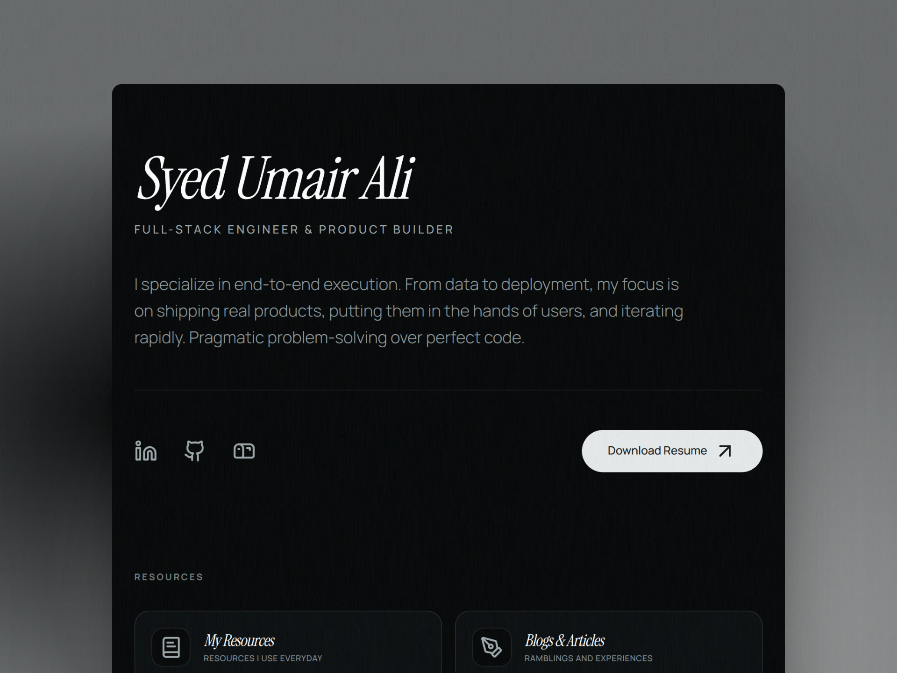

# Syed Umair Ali | Full-Stack Engineer & Product Builder



> **I specialize in end-to-end execution.** From data to deployment, my focus is on shipping real products, putting them in the hands of users, and iterating rapidly. Pragmatic problem-solving over perfect code.

This repository holds the source code for my personal portfolio, digital garden (blog), and engineering archive. It is designed with a highly optimized, minimalist editorial aesthetic and heavily leverages modern web technologies for maximum performance and AI-engine discoverability.

🌐 **Live Site:** [syedumaircodes.vercel.app](https://syedumaircodes.vercel.app/)

## ⚡ Tech Stack

- **Framework:** [React 19](https://react.dev/) + [Vite 7](https://vitejs.dev/)
- **Styling:** [Tailwind CSS v4](https://tailwindcss.com/) (using OKLCH semantic color variables)
- **Typography:** Instrument Serif (Headings) & Manrope (Sans)
- **Motion:** [Motion](https://motion.dev/) (formerly Framer Motion) for staggered layout reveals and hardware accelerated micro-interactions.
- **Content:** MDX (`@mdx-js/rollup`) + Tailwind Typography for file-based blog routing.

## ✨ Key Architecture & Features

### 1. AEO & GEO Optimized (AI-First SEO)

Traditional keyword SEO is dead. This portfolio is engineered for **Answer Engine Optimization (AEO)** and **Generative Engine Optimization (GEO)** (Perplexity, ChatGPT, Google AI Overviews).

- Dynamic `react-helmet-async` injection.
- Strict `application/ld+json` Schema markup (`@type: "Person"` and `@type: "BlogPosting"`) mapped to my GitHub and LinkedIn.
- Accessible markup for screen readers (`sr-only` icon labels).

### 2. MDX Digital Garden

The `/blogs` route acts as a static CMS. Powered by Vite 7's `import.meta.glob({ eager: true })`, it parses local `.mdx` files into React components at build time, resulting in instantaneous page loads without database queries or layout shifts.

### 3. Editorial Dark Mode

Structurally locked into a pure dark-mode UI. It completely avoids JS-based theme providers in favor of native `:root` OKLCH variable overrides in `index.css` for zero-flash initial loading. Features luxury-print design cues, extreme negative space, and typographic hierarchy.

## 🚀 Local Development

To clone and run this project locally:

**1. Clone the repository**

```bash
git clone https://github.com/syedumaircodes/portfolio.git
cd portfolio
```

**2. Install dependencies**

```bash
npm install
```

**3. Start the development server**

```bash
npm run dev
```

## 📂 Project Structure

```text
src/
├── components/      # Reusable UI components (Hero, SEO, Footer, Modals)
├── content/         # .mdx files for engineering notes/blogs
├── data/            # data.ts (Projects, tech stack, and metrics definitions)
├── pages/           # Route views (Home, Blogs, BlogPost, Uses, NotFound)
├── App.tsx          # React Router & HelmetProvider setup
└── index.css        # Tailwind v4 imports and OKLCH root variables
```

## 🤝 Let's Connect

If you're looking for a developer who cares about shipping, or just want to chat about system architecture and building products:

- **LinkedIn:** [linkedin.com/in/syedumaircodes](https://linkedin.com/in/syedumaircodes)
- **Email:** syedumairali.617@gmail.com

---

_Crafted in Karachi, Pakistan._
